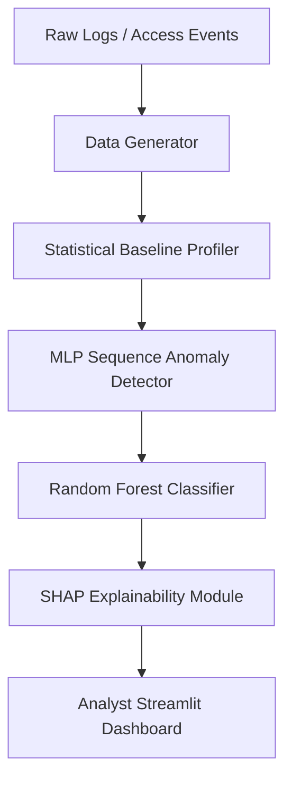

<div align="center">
  <h1>🛡️ Sentinel-AI</h1>
  <p><b>Next-Generation Behavioral Anomaly Detection for Modern SOCs</b></p>
  <p><i>Developed as a Solo Submission for the <b>Honeywell Hackathon</b></i></p>
  <p><b>Author & Sole Contributor:</b> Heet Vachhani</p>
</div>

---

## 📌 Overview
Traditional signature-based security relies on static rules and known malware hashes, causing it to fail against novel, low-and-slow, or credential-based intrusions. 

**Sentinel-AI** is a dual-layered, AI-powered behavioral anomaly detection system. It actively learns the "normal" behavioral patterns (timing, location, access sequences) for users, service accounts, and edge devices. By combining a Statistical Baseline Profiler with an MLP Sequence Detector and a Random Forest Classifier, it flags deviations in near real-time and categorizes the exact threat type.

Every alert is augmented with an **Explainable AI (XAI)** layer using SHAP, empowering SOC analysts to instantly understand *why* an event was flagged.

## 🚀 Key Achievements

* **Robust Data Synthesis:** Handled extreme class imbalance by generating and processing **50,182** highly-realistic access logs across 500 distinct entities with a controlled **3.35% anomaly rate**.
* **Smart Alert Budgeting:** Boosted ensemble **ROC-AUC to 0.84**, ensuring that at a realistic 5% SOC Alert Budget, analysts receive high-confidence threats with a tiny 4% False Positive Rate.
* **Granular Threat Categorization:** The supervised classifier achieved an impressive **0.82 Macro F1-score**, correctly disambiguating complex attacks with high recall:
  * **94%+ Recall** on *Device Spoofing*, *Lateral Movement*.
  * **100% Recall** on *Impossible Travel*, *Insider Drift*, and *Low & Slow Exfiltration*.

## 🏗️ System Architecture



## 📂 Repository Structure
- `/data_gen`: Synthetic access-log generator handling complex stateful threats (Faker/NumPy).
- `/models`: Core ML logic including baseline profiling, sequence detection, and classification.
- `/explain`: Feature attribution per alert using SHAP.
- `/dashboard`: Interactive SOC Analyst dashboard built with Streamlit and Plotly.

## ⚙️ Setup & Installation

**1. Create & Activate Virtual Environment**
```bash
python -m venv venv
source venv/bin/activate  # On Windows: venv\Scripts\activate
```

**2. Install Dependencies**
```bash
pip install -r requirements.txt
```

## 🛠️ Usage

**1. Generate Data**
Generates 50,000+ sessions injected with 7 unique threat categories.
```bash
python data_gen/generate.py
```

**2. Train & Evaluate Models**
Trains the Baseline Profiler, Sequence Detector, and Classifier using a strict 80/20 held-out test split to ensure robust evaluation.
```bash
python models/train_evaluate.py
```

**3. Launch the SOC Dashboard**
Fire up the Streamlit app to view the alert queue, investigate entities, and analyze SHAP values.
```bash
cd dashboard
streamlit run app.py
```

---
<div align="center">
  <p>Built with 💡 for the Honeywell Innovation ecosystem by Heet Vachhani.</p>
</div>
