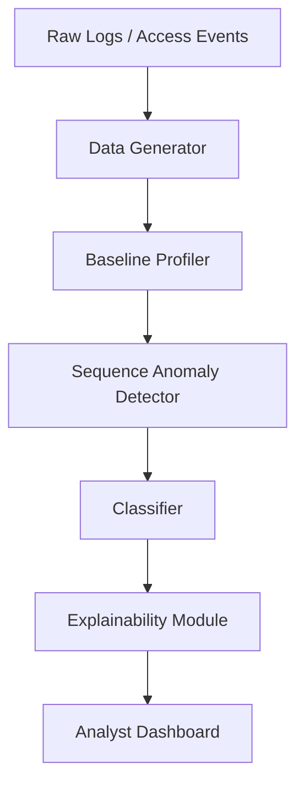

# Sentinel-AI

Sentinel-AI is a cybersecurity behavioral anomaly detection system designed to model "normal" access and connection behavior for users and devices, detect intrusions or compromised-credential activity in near real-time, and classify the type of anomaly with an explainable risk score.

## Architecture



## Setup & Installation

1. Create a virtual environment and activate it:
   ```bash
   python -m venv venv
   source venv/bin/activate  # Or venv\Scripts\Activate.ps1 on Windows
   ```

2. Install dependencies:
   ```bash
   pip install -r requirements.txt
   ```

## Usage

1. **Generate Synthetic Data**:
   This generates a dataset of 50,000 normal sessions and injects 7 types of anomalies at a controlled rate (0.5% - 3%).
   ```bash
   python data_gen/generate.py
   ```

2. **Train Models and Evaluate**:
   This trains the Statistical Baseline Profiler, the Sequence Detector (LSTM), and the Anomaly Classifier (Random Forest). It also evaluates the models and saves them to `models/saved_models/`.
   ```bash
   cd models
   python train_evaluate.py
   ```

3. **Run Dashboard**:
   Launch the Streamlit app to view the alert queue and entity history.
   ```bash
   cd dashboard
   streamlit run app.py
   ```

## Modules
- `/data_gen`: Synthetic access-log generator with Faker and NumPy.
- `/models`: Contains baseline profiling (statistical + autoencoder), sequence detection (LSTM), and classification (Random Forest).
- `/explain`: Feature attribution per alert using SHAP.
- `/dashboard`: Analyst-facing dashboard built with Streamlit and Plotly.
- `/notebooks`: Space for exploration and experiments.
