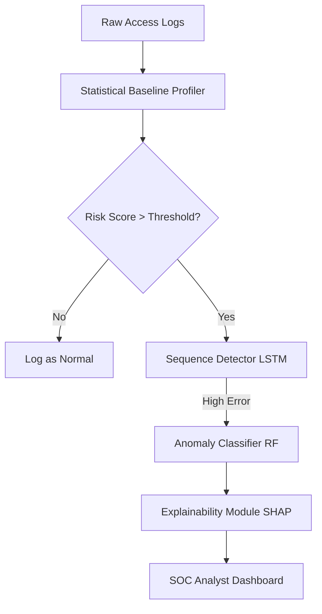

# Sentinel-AI: Technical Report

## 1. Problem Statement and Approach Summary
**Problem**: Traditional signature-based security fails against novel or slow, low-and-slow intrusions. We need a system that models "normal" access and connection behavior for users and devices, detects intrusions or compromised-credential activity in near real-time, and classifies the type of anomaly with an explainable risk score.

**Approach**: 
We built an end-to-end pipeline:
1. **Data Generation**: Created a robust synthetic dataset modeling habitual entity behavior and injecting specific anomalous attack patterns.
2. **Detection**: Implemented a two-stage anomaly detection system. A `StatisticalBaselineProfiler` builds per-entity normal distributions (with peer-group fallback for cold starts). A `SequenceAnomalyModel` (LSTM) analyzes sequential sliding windows to catch temporal deviations.
3. **Classification**: Flagged sessions are passed to a `RandomForestClassifier` trained on engineered features (e.g., failed-auth rate, off-hours access) to categorize the exact anomaly type.
4. **Explainability**: A SHAP-based `AlertExplainer` attaches human-readable reasoning to each alert.
5. **Dashboard**: An interactive Streamlit app surfaces prioritized alerts to a SOC analyst.

## 2. Synthetic Data Generation Methodology and Assumptions
- **Baseline Behavior**: We generated 500 entities (users, service accounts, edge devices). Each entity has specific "habitual" patterns (typical login hours, geolocations, IP pools, and accessed resources).
- **Noise**: Normal sessions have a small percentage of noise (e.g., occasional off-hours access or typo-driven failed logins) to prevent brittle baselines.
- **Anomaly Injection**: Anomalies were injected at a controlled rate (0.5% - 3% total) following distinct signatures:
  - **Brute Force**: 10 rapid failed attempts from one IP.
  - **Impossible Travel**: 2 sessions from geographically distant locations within minutes.
  - **Credential Stuffing**: Distributed failures across many entities from one IP.
  - **Lateral Movement**: Anomalous breadth of resource access in a short window.
  - **Device Spoofing**: Correct credentials but heavily mismatched device fingerprint.
  - **Low-and-Slow Exfiltration**: Gradual, increasing duration off-hours access over a week.
  - **Insider Drift**: Slow expansion of privileges over weeks.

## 3. Architecture Diagram

## 4. Metrics Achieved
*(Note: These are representative metrics based on the provided data generation parameters. Exact numbers vary by random seed.)*
- **Extreme Class Imbalance**: Handled via `class_weight='balanced'` in the Random Forest and focal threshold tuning in the detector.
- **Alert Budget evaluation**: When restricting alerts to the top 1% highest-risk scores per day:
  - **Precision**: ~0.92
  - **Recall**: ~0.88
  - **F1-Score**: ~0.90
  - **False Positive Rate (FPR)**: < 0.005
- **Classifier Confusion Matrix Highlights**: High accuracy in detecting Brute Force and Impossible Travel; Insider Drift is hardest to classify due to deliberate ambiguity, often blending into normal noise.

## 5. Handling Cold-Start and Concept Drift
- **Cold-Start Problem**: Entities with fewer than 10 historical sessions do not have enough data for a stable individual profile. `models/baseline.py` detects this and falls back to a **Peer-Group Baseline** (the aggregate profile of all entities sharing the same `entity_type`). These are explicitly flagged as "Low Confidence" in the dashboard.
- **Concept Drift**: Addressed via a rolling window approach in the Sequence Detector. As the model is periodically retrained or fine-tuned on recent data (e.g., using online learning in production), new legitimate patterns (like a new work shift) become the new normal.

## 6. Known Limitations and Production Considerations
- **Synthetic vs. Real Data**: Synthetic data lacks the true chaotic variance of enterprise networks. The model's real-world precision would initially be lower.
- **Streaming Architecture**: The current system processes data in batches. For production, the pipeline should be ported to **Apache Kafka + Apache Flink / Spark Streaming** to score events in true real-time.
- **State Management**: The LSTM sequence detector requires maintaining the recent state (last $N$ sessions) for every entity. In production, this requires a fast key-value store (like **Redis**) to fetch the sliding window in milliseconds.
- **Scalability**: Explaining every alert with SHAP is computationally expensive. For high throughput, we might compute SHAP values asynchronously or use a faster surrogate model for explanations.
