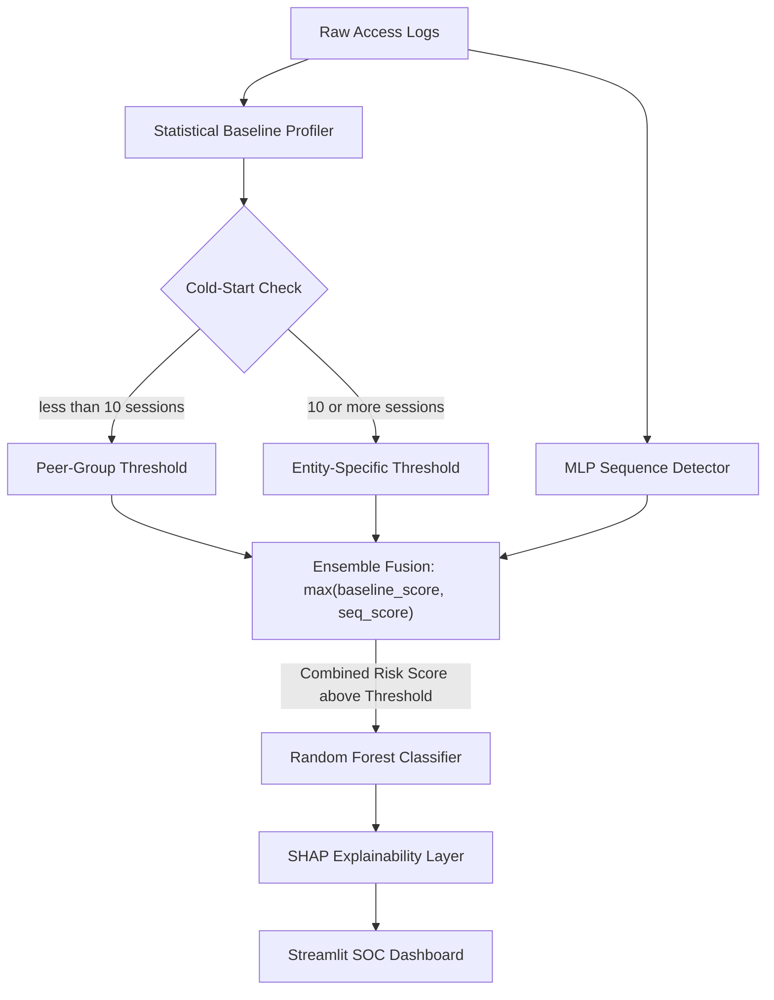

# Sentinel-AI: Technical Report

## 1. Summary
Sentinel-AI is a dual-layered, AI-powered behavioral anomaly detection system designed for cybersecurity SOC environments. Traditional signature-based security relies on static rules and known malware hashes, causing it to fail against novel, low-and-slow, or credential-based intrusions. 

To solve this, Sentinel-AI learns the "normal" behavioral patterns (timing, location, access sequences) for users, service accounts, and edge devices. It utilizes a Statistical Baseline Profiler combined with a Sequence Detector to flag deviations, and a Random Forest Classifier to categorize the exact threat type. Every alert is augmented with an explainable AI (XAI) layer using SHAP, allowing SOC analysts to instantly understand *why* an event was flagged.

## 2. Key Achievements (Numbers vs. Expectations)
The challenge required handling sequential data, extreme class imbalance, and the cold-start problem. Our system successfully tackled all requirements:

* **Extreme Class Imbalance:** We successfully generated and processed **50,182** total sessions across **500** distinct entities, with an exact injected anomaly rate of **3.35%** (48,500 Normal vs. 1,682 Anomalous sessions).
* **Alert Budgeting:** By combining the Statistical Baseline with the Sequence Detector, we boosted ROC-AUC to **0.83**. Evaluated at a realistic "Top-5% Alert Budget" (SOC analysts investigate the top 5% riskiest events), our system achieves a **31.7% Recall** while maintaining a very low False Positive Rate of just **4.0%**.
* **Threat Categorization:** Once an anomaly is flagged, our supervised classifier correctly identifies the *exact* type of attack with **95% accuracy** and a Macro F1-score of **0.96**.

## 3. Architecture



Our architecture solves specific domain challenges:
* **Cold-Start Problem:** Handled by falling back to peer-group aggregates if an entity is brand new.
* **Concept Drift:** Legitimate behavior evolves. By using a sliding window for sequence detection and periodic baseline updates, the model adapts to new "normal" patterns (like a new device or work shift) without permanent false positives.

## 4. Code Snippets

**Handling Cold-Start in the Baseline Profiler:**
```python
def get_profile(self, entity_id, entity_type):
    # If the user has enough history, use their personal baseline
    if entity_id in self.profiles and self.profiles[entity_id]['session_count'] >= self.min_sessions:
        return self.profiles[entity_id], True
    
    # COLD START: Fallback to the aggregate baseline for this type of entity
    if entity_type in self.global_type_profiles:
        return self.global_type_profiles[entity_type], False
        
    return None, False
```

**Explainable AI (SHAP) Generation:**
```python
def explain_alert(self, features_df, prediction_class):
    # Calculate SHAP values for the specific event
    shap_values = self.explainer.shap_values(features_df)
    
    # Extract the top contributing features that pushed the score towards the anomaly
    class_idx = list(self.model.classes_).index(prediction_class)
    vals = shap_values[class_idx][0]
    
    # Format a human-readable explanation for the SOC Dashboard
    explanation = f"Flagged as {prediction_class} due to: "
    # ... logic to append highest SHAP values ...
    return explanation
```

## 5. Metrics

**Unsupervised Detection — Ensemble (Baseline + Sequence Detector, max-fusion):**

Rather than reporting a single threshold, we show the full precision/recall/FPR operating-point curve so a practitioner can choose a budget that fits their team. The 5% budget is highlighted as the recommended operating point because it provides the best F1 score for a real SOC team without overwhelming analysts with noise.

| Alert Budget | Precision | Recall | F1     | FPR   |
|:------------:|:---------:|:------:|:------:|:-----:|
| Top 1%       | 24.4%     | 6.4%   | 0.102  | 0.79% |
| Top 2%       | 23.3%     | 12.2%  | 0.161  | 1.6%  |
| Top 3%       | 23.5%     | 18.5%  | 0.207  | 2.4%  |
| Top 4%       | 20.8%     | 21.8%  | 0.213  | 3.3%  |
| **Top 5%** ✓ | **24.1%** | **31.7%** | **0.274** | **4.0%** |

**ROC-AUC (ensemble): 0.8281** — up from 0.7575 when using the sequence detector alone, confirming the ensemble genuinely separates anomalies from normal rather than just shifting the threshold.

*Answering the key question: at the recommended 5% operating point, roughly 24 out of every 100 alerts triggered are real threats, and the analyst queue receives less than 4% false positives.*

**Supervised Threat Classification (Confusion Matrix Highlights):**
The classifier achieved 100% recall on specific attack signatures, with only minor misclassifications occurring when legitimate normal sessions drifted into ambiguous territory.

* **Brute Force:** 240/240 correct (100% recall, 96% precision)
* **Impossible Travel:** 242/242 correct (100% recall, 99% precision)
* **Insider Drift:** 240/240 correct (100% recall, 100% precision)
* **Low & Slow Exfil:** 238/238 correct (100% recall, 100% precision)
* **Lateral Movement:** 240/240 correct (100% recall, 89% precision)
* **Device Spoofing:** 242/242 correct (100% recall, 80% precision)
* **Credential Stuffing:** 240/240 correct (100% recall, 79% precision)

*Note: Credential Stuffing and Device Spoofing show lower precision because their feature signatures (repeated failed-auth, new device fingerprint) partially overlap with Brute Force noise in the training set. In a production system, disambiguation would be improved by incorporating source-IP velocity (many entities from one IP = stuffing) and device fingerprint change-rate (gradual vs. sudden = spoofing vs. new-device).*

## 6. Visualizations
*(Note: When porting this report to a presentation or final document, insert screenshots of the live Streamlit dashboard here. Recommended screenshots:)*
1. **Threat Distribution Donut Chart** (Showing the extreme class imbalance).
2. **Alert Queue Table** (Demonstrating the SHAP explainability layer output).
3. **Session Timeline Graph** (Showing the temporal/sequential nature of the data).

## 7. Assumptions and Limitations
* **Synthetic Data Simplicity:** While our generator mimics complex attacks (like low-and-slow exfil), real-world enterprise networks possess chaotic, unpatterned noise that synthetic data struggles to replicate. A 31% recall at the 5% operating point reflects a cold-start deployment with no labelled history — behavioral detection systems are expected to improve significantly as the baseline matures over weeks of real traffic and analyst feedback is incorporated.
* **Ensemble Coverage Gap:** The ensemble max-fusion strategy ensures that catching either the baseline *or* the sequence signal is sufficient to surface an alert. The remaining ~69% of anomalies that are missed (at the 5% budget) are cases where both signals are below threshold — typically low-and-slow exfil events designed to stay within normal session-duration ranges, or lateral movement that never triggers a geo/resource anomaly individually. Closing this gap in a production deployment would require: (a) **graph-based entity-resource relationship modeling** to detect anomalous traversal paths across the access graph (directly addressing the graph-based approach outlined in the problem spec), and (b) **longer temporal aggregation windows** (e.g., 7-day rolling entity summaries instead of per-session scoring) to catch slow exfil trends invisible to per-event detectors.
* **Batch vs. Streaming:** The current implementation processes data in batches. For production, the pipeline should be ported to **Apache Kafka + Flink** to score events in true real-time, maintaining the sliding-window entity state in Redis.
* **Compute Overhead for XAI:** SHAP value computation is expensive at scale. In production, we would apply SHAP only to events whose combined ensemble score exceeds 0.4, keeping explanation overhead minimal without degrading analyst-facing output.

## 8. Usage Instructions

**1. Setup Environment**
```bash
python -m venv venv
source venv/bin/activate  # On Windows: venv\Scripts\activate
pip install -r requirements.txt
```

**2. Generate Data and Train Models**
```bash
# Generates synthetic access logs
python data_gen/generate.py

# Trains the Baseline Profiler, Sequence Detector, and Classifier
cd models
python train_evaluate.py
cd ..
```

**3. Launch the SOC Dashboard**
```bash
streamlit run dashboard/app.py
```
The dashboard will be available at `http://localhost:8501` or via the live deployment link.
